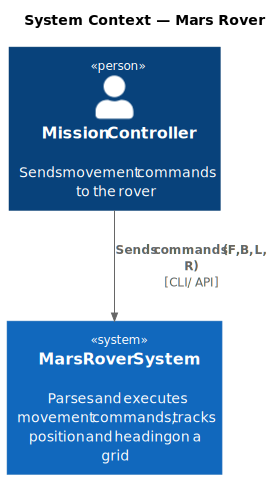

# Chapter 3: System Scope and Context

## System Context

The Mars Rover system takes a command string from a mission controller and returns the rover's final position and heading. There are no external systems or databases.

## Interfaces

| Interface | Direction | Description |
|-----------|-----------|-------------|
| Command input | Inbound | String of characters: `F`, `B`, `L`, `R` |
| Position output | Outbound | Final `(x, y, heading)` or obstacle report |
